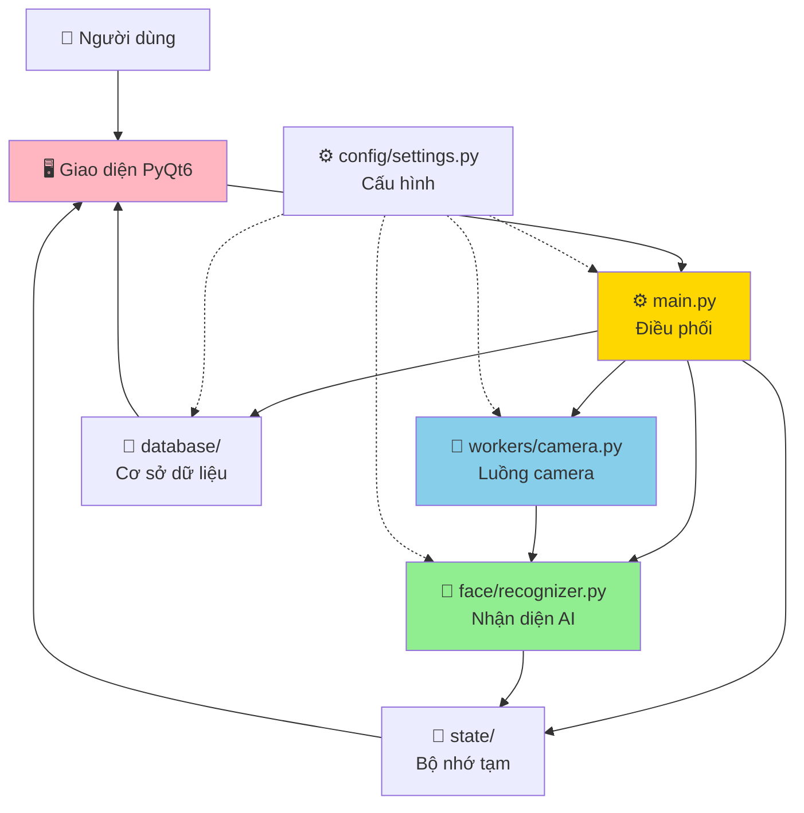
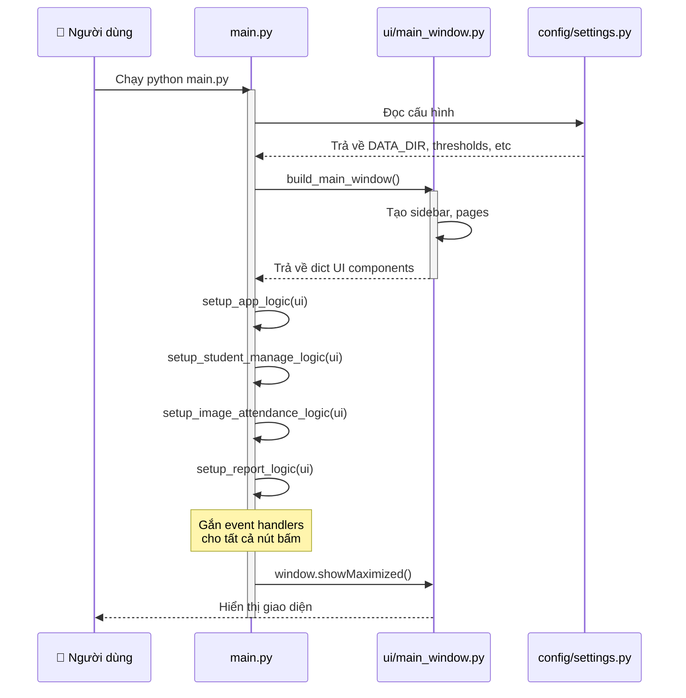
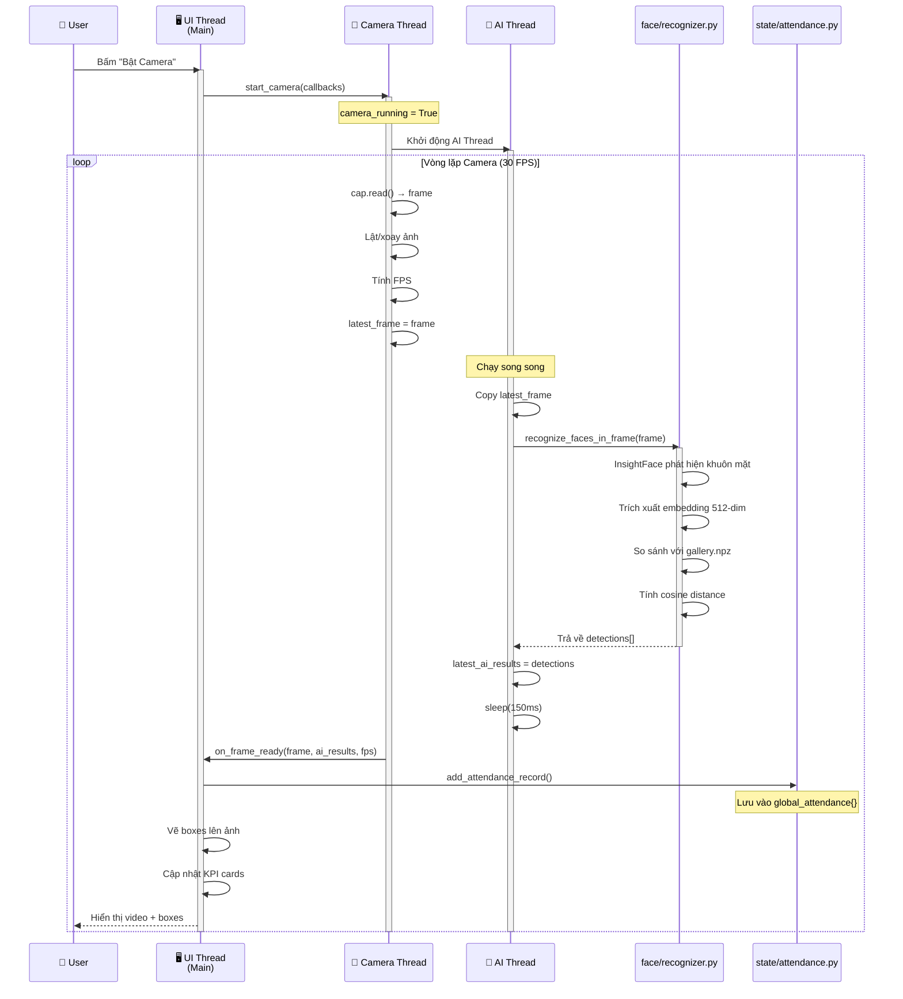
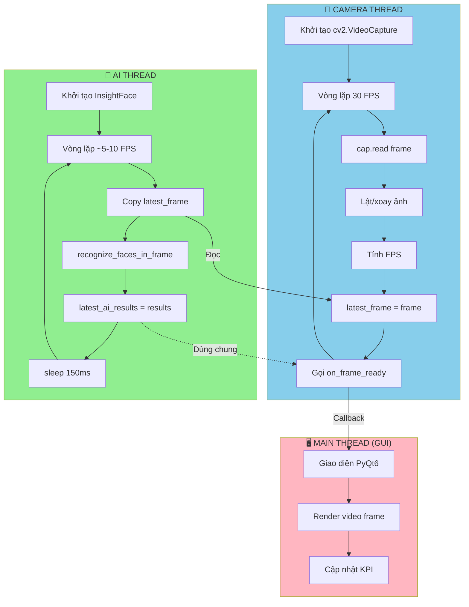
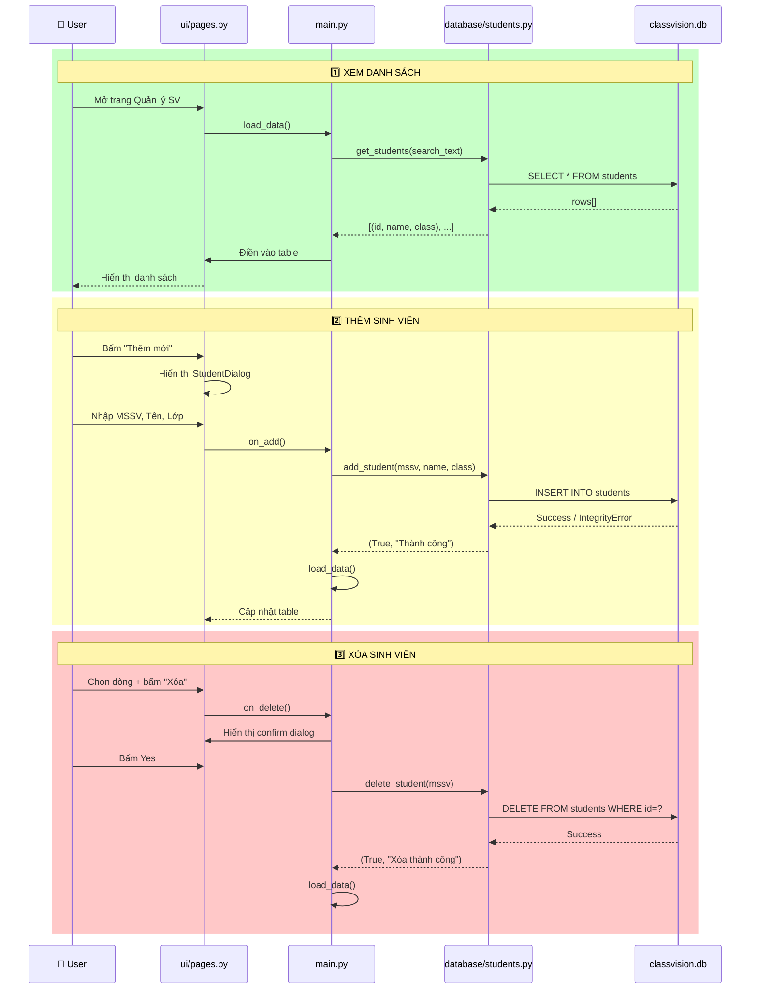
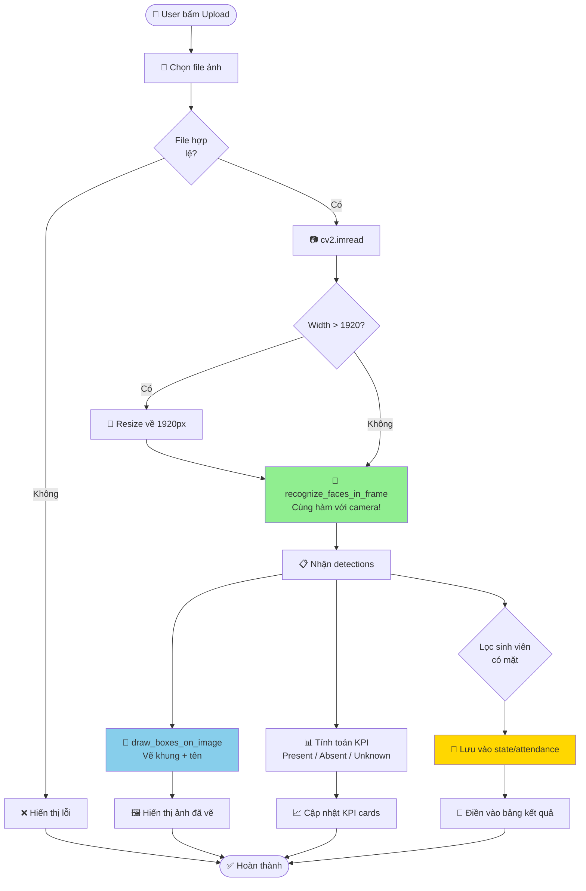
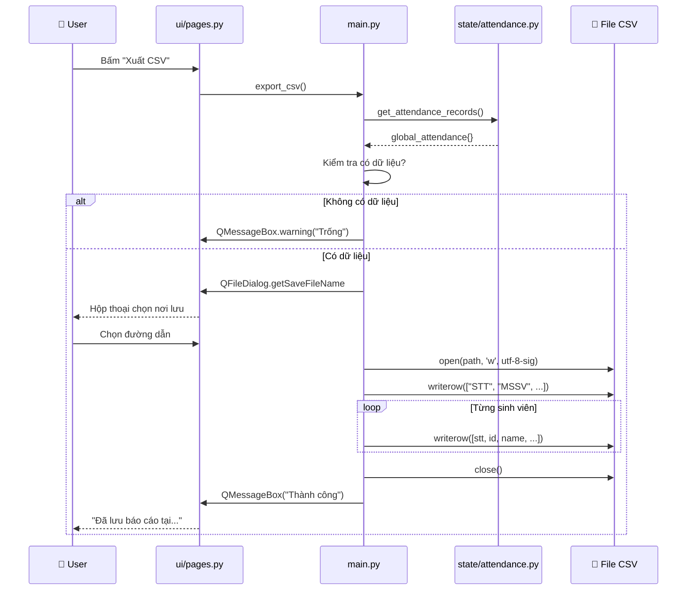
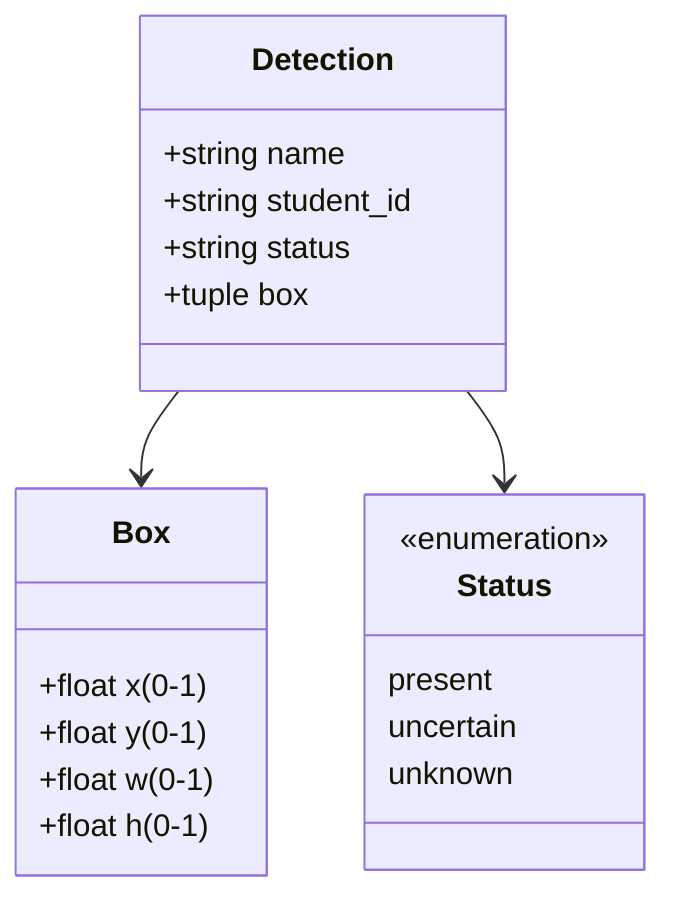
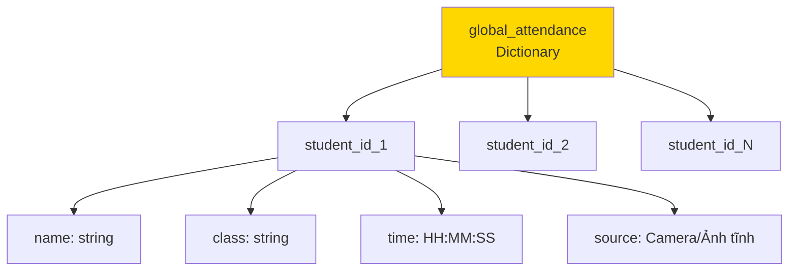

# Sơ Đồ Luồng Hoạt Động - ClassVision

## 1. TỔNG QUAN KIẾN TRÚC HỆ THỐNG



---

## 2. LUỒNG KHỞI ĐỘNG ỨNG DỤNG



---

## 3. LUỒNG ĐIỂM DANH BẰNG CAMERA (Quan trọng nhất!)



---

## 4. LUỒNG XỬ LÝ NHẬN DIỆN KHUÔN MẶT (Chi tiết)

```mermaid
flowchart TD
    Start([📸 Nhận frame từ camera]) --> Check{Frame có<br/>dữ liệu?}
    Check -->|Không| Error[❌ Báo lỗi]
    Check -->|Có| InitCheck{Model đã<br/>load?}
    
    InitCheck -->|Chưa| LoadModel[🔄 init_face_model<br/>- Load InsightFace buffalo_s<br/>- Load gallery.npz<br/>- Normalize embeddings]
    InitCheck -->|Rồi| Detect
    LoadModel --> Detect
    
    Detect[🔍 InsightFace.get<br/>Phát hiện khuôn mặt] --> HasFaces{Có khuôn<br/>mặt?}
    
    HasFaces -->|Không| ReturnEmpty[📋 Trả về list rỗng]
    HasFaces -->|Có| LoopFaces[🔄 Duyệt từng khuôn mặt]
    
    LoopFaces --> ExtractBox[📐 Lấy bounding box<br/>x1, y1, x2, y2]
    ExtractBox --> NormalizeBox[📏 Chuẩn hóa box về 0-1<br/>theo kích thước ảnh]
    
    NormalizeBox --> ExtractEmb[🧮 Lấy embedding vector<br/>512 chiều từ InsightFace]
    ExtractEmb --> NormalizeEmb[📊 Chuẩn hóa L2<br/>query_emb / ||query_emb||]
    
    NormalizeEmb --> CheckGallery{Gallery<br/>có dữ liệu?}
    CheckGallery -->|Không| Unknown1[❓ Đánh dấu Unknown]
    CheckGallery -->|Có| CalcDist
    
    CalcDist[🎯 Tính cosine distance<br/>dist = 1 - dot_product] --> FindBest[🏆 Tìm sinh viên gần nhất<br/>best_idx = argmin]
    
    FindBest --> CompareThreshold{best_dist ≤<br/>threshold?}
    CompareThreshold -->|≤ 0.38| Present[✅ Present<br/>Có mặt chắc chắn]
    CompareThreshold -->|> 0.38| CheckUncertain{≤ 0.46?}
    
    CheckUncertain -->|Có| Uncertain[⚠️ Uncertain<br/>Cần xem xét]
    CheckUncertain -->|Không| Unknown2[❓ Unknown<br/>Không nhận ra]
    
    Present --> AddResult[➕ Thêm vào detections]
    Uncertain --> AddResult
    Unknown1 --> AddResult
    Unknown2 --> AddResult
    
    AddResult --> MoreFaces{Còn khuôn<br/>mặt khác?}
    MoreFaces -->|Có| LoopFaces
    MoreFaces -->|Không| Return[📤 Trả về detections]
    
    ReturnEmpty --> End([🏁 Kết thúc])
    Return --> End
    Error --> End
    
    style Start fill:#90ee90
    style Detect fill:#87ceeb
    style CalcDist fill:#ffd700
    style Present fill:#00ff00
    style Uncertain fill:#ffff00
    style Unknown2 fill:#ff6347
```

---

## 5. LUỒNG THREADING (2 Luồng Song Song)



**⚠️ GIẢI THÍCH QUAN TRỌNG:**
- **Camera Thread**: Chạy nhanh 30 FPS, chỉ đọc frame
- **AI Thread**: Chạy chậm 5-10 FPS, xử lý AI nặng
- **Tại sao 2 threads?**: Để camera không bị giật lag khi AI xử lý
- **latest_frame**: Biến global chia sẻ giữa 2 threads
- **latest_ai_results**: Kết quả AI mới nhất

---

## 6. LUỒNG QUẢN LÝ SINH VIÊN (CRUD)



---

## 7. LUỒNG ĐIỂM DANH BẰNG ẢNH TĨNH



---

## 8. LUỒNG XUẤT BÁO CÁO CSV



---

## 9. CẤU TRÚC DỮ LIỆU

### 9.1. Gallery (Face Database)

```mermaid
graph LR
    Gallery[gallery.npz] --> StudentIDs[student_ids<br/>Array string]
    Gallery --> Names[full_names<br/>Array string]
    Gallery --> Classes[class_names<br/>Array string]
    Gallery --> Embeddings[embeddings<br/>Matrix N×512]
    
    Embeddings --> Normalized[Đã chuẩn hóa L2<br/>||emb|| = 1]
    
    style Gallery fill:#ffd700
    style Embeddings fill:#90ee90
```

### 9.2. Detection Result



### 9.3. Attendance Record



---

## 10. COSINE SIMILARITY (Toán học quan trọng!)

```mermaid
graph TB
    subgraph Input["📥 ĐẦU VÀO"]
        Query[Query Embedding<br/>512 chiều<br/>từ khuôn mặt mới]
        Gallery[Gallery Embeddings<br/>N × 512<br/>từ gallery.npz]
    end
    
    subgraph Normalize["📐 CHUẨN HÓA L2"]
        NormQuery[||query|| = 1<br/>query / sqrt sum_query²]
        NormGallery[||gallery|| = 1<br/>Đã làm lúc load]
    end
    
    subgraph Calculate["🧮 TÍNH TOÁN"]
        DotProduct[Dot Product<br/>similarity = gallery · query<br/>Phép nhân ma trận]
        Distance[Cosine Distance<br/>dist = 1 - similarity<br/>Càng nhỏ càng giống]
        Clip[Clip về 0-2<br/>Tránh lỗi số học]
    end
    
    subgraph Output["📤 KẾT QUẢ"]
        ArgMin[argmin distances<br/>Tìm SV gần nhất]
        BestDist[best_dist<br/>Khoảng cách nhỏ nhất]
    end
    
    subgraph Threshold["🎯 NGƯỠNG"]
        Check1{dist ≤ 0.38?}
        Check2{dist ≤ 0.46?}
        Present[✅ Present]
        Uncertain[⚠️ Uncertain]
        Unknown[❓ Unknown]
    end
    
    Query --> NormQuery
    Gallery --> NormGallery
    
    NormQuery --> DotProduct
    NormGallery --> DotProduct
    
    DotProduct --> Distance
    Distance --> Clip
    Clip --> ArgMin
    Clip --> BestDist
    
    BestDist --> Check1
    Check1 -->|Có| Present
    Check1 -->|Không| Check2
    Check2 -->|Có| Uncertain
    Check2 -->|Không| Unknown
    
    style DotProduct fill:#90ee90
    style Distance fill:#87ceeb
    style Present fill:#00ff00
    style Uncertain fill:#ffff00
    style Unknown fill:#ff6347
```

**CÔNG THỨC:**
```
similarity = cos(θ) = (A · B) / (||A|| × ||B||)
distance = 1 - similarity
```

**Nếu embedding đã chuẩn hóa (||A|| = ||B|| = 1):**
```
distance = 1 - (A · B)
```

---

## 11. TÓM TẮT CÁC LUỒNG CHÍNH

| Luồng | File chính | Mô tả ngắn gọn |
|-------|-----------|----------------|
| 🚀 **Khởi động** | main.py | Load config → Build UI → Setup handlers |
| 🎥 **Camera** | workers/camera.py | 2 threads: Camera 30 FPS + AI 5-10 FPS |
| 🤖 **Nhận diện** | face/recognizer.py | InsightFace → Embedding → Cosine distance |
| 👥 **Quản lý SV** | database/students.py | CRUD trên SQLite |
| 📷 **Ảnh tĩnh** | main.py | Upload → Nhận diện → Hiển thị |
| 📊 **Báo cáo** | state/attendance.py | In-memory → Export CSV |

---

## 12. CÂU HỎI THƯỜNG GẶP KHI BẢO VỆ

### Q1: "Tại sao cần 2 threads?"
**A:** 
- Thread 1 (Camera): Đọc frame nhanh 30 FPS, không bị giật
- Thread 2 (AI): Xử lý chậm 5-10 FPS, không làm lag camera
- Nếu 1 thread: AI chậm → camera giật lag

### Q2: "Giải thích cosine similarity"
**A:**
- Đo độ giống nhau giữa 2 vector
- Cos(0°) = 1 (giống nhau)
- Cos(90°) = 0 (khác nhau)
- Distance = 1 - similarity
- Threshold 0.38: Nếu dist ≤ 0.38 → Nhận diện đúng

### Q3: "Tại sao normalize embedding?"
**A:**
- Để chỉ so sánh hướng, không so sánh độ dài
- Sau normalize: ||emb|| = 1
- Cosine similarity = dot product (nhanh hơn)

### Q4: "InsightFace làm gì?"
**A:**
- Phát hiện khuôn mặt (bounding box)
- Trích xuất đặc trưng (embedding 512-dim)
- Embedding: Vector đại diện khuôn mặt
- Học từ hàng triệu ảnh

### Q5: "Giải thích _GuiInvoker"
**A:**
- Qt không cho update GUI từ thread khác
- _GuiInvoker dùng Signal/Slot
- Signal emit từ worker thread
- Slot chạy ở main thread → An toàn

---

**🎯 LỜI KHUYÊN KHI BẢO VỆ:**

1. **Vẽ sơ đồ**: In sơ đồ này ra, trỏ vào giải thích
2. **Nhấn mạnh**: "Em dùng InsightFace cho detection và embedding"
3. **Giải thích toán**: Cosine similarity công thức đơn giản
4. **Threading**: "Camera nhanh, AI chậm, nên em tách ra"
5. **Thành thật**: "Phần này em dùng thư viện, em hiểu cách hoạt động"

**Tránh nói:** "Em tự code từ đầu" → Sẽ bị hỏi sâu!

**Nên nói:** "Em sử dụng InsightFace, một mô hình state-of-the-art, kết hợp với cosine similarity để matching"
